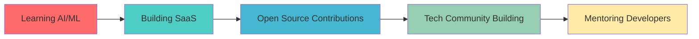

<div align="center">
  
</div>

#  Hi there, I'm VANNLITHI KIM

<div align="center">
  
</div>

<div align="center">
  
  
  
</div>


## &nbsp;***About Me***

<div align="center">
  
</div>


```yaml
name: [Vannlithi KIM]
located_in: Your Location 🌍
current_job: Full Stack Developer
education: ["Self-Taught", "Computer Science"]
company: Your Company / Freelance

fields_of_interests:
  - "Web Development"
  - "Mobile Development" 
  - "DevOps"
  - "Machine Learning"
  - "Open Source"
  
technical_background:
  - "Frontend Development"
  - "Backend Development"
  - "Database Design"
  - "Cloud Architecture"
  
currently_learning: ["Next.js 14", "TypeScript", "Docker", "AWS"]
2024_goals: ["Contribute to Open Source", "Build SaaS Product", "Learn AI/ML"]
hobbies: ["Gaming 🎮", "Photography 📸", "Traveling ✈️", "Coffee ☕"]
```


##  Technologies & Tools

<div align="center">

###  Programming Languages

<p>
    
    
    
<!--     
    
     -->
</p>

###  Frontend Development

<p>
    
    
    
    
    
</p>

<p>
    
    
    
    
    
</p>

###  Backend Development

<p>
    
    
    
    
    
    
</p>

###  Database

<p>
    
    
    
    
    
    
</p>

### ☁️ Cloud & DevOps

<p>
    
    
    
    
    
</p>

### 🛠️ Tools & IDEs

<p>
    
    
    
    
    
    
</p>

</div>


##  GitHub Stats & Analytics

<div align="center">
  
  
</div>

<div align="center">
  
</div>

<div align="center">
  
</div>


## 🏆 GitHub Trophies

<div align="center">
  
</div>


##  Featured Projects

<div align="center">

<table>
<tr>
<td width="50%">

<h3 align="center">🚀 Amazing Project 1</h3>
<div align="center">  
<a href="https://github.com/yourusername/project1" target="_blank">

</a>
</div>
<p align="center">
<a href="https://github.com/yourusername/project1" target="_blank">

</a>  
<a href="https://your-live-demo1.com" target="_blank">

</a>
</p>

</td>
<td width="50%">

<h3 align="center">🎨 Creative Project 2</h3>
<div align="center">
<a href="https://github.com/yourusername/project2" target="_blank">

</a>
</div>
<p align="center">
<a href="https://github.com/yourusername/project2" target="_blank">

</a>
<a href="https://your-live-demo2.com" target="_blank">

</a>
</p>

</td>
</tr>
</table>

</div>


##  Connect With Me

<div align="center">

<a href="https://linkedin.com/in/yourprofile" target="_blank">

</a>

<a href="https://twitter.com/yourhandle" target="_blank">

</a>

<a href="https://yourportfolio.com" target="_blank">

</a>

<a href="mailto:your.email@example.com">

</a>

<a href="https://discord.gg/yourinvite" target="_blank">

</a>

<a href="https://instagram.com/yourhandle" target="_blank">

</a>

</div>


## 💭 Random Dev Quote

<div align="center">
  
</div>


## 🎵 What I'm Listening To

<div align="center">
  
[](https://open.spotify.com/user/your_spotify_username)

</div>


##  Latest Blog Posts

<!-- BLOG-POST-LIST:START -->
- 📝 [How to Build Amazing React Applications](https://yourblog.com/post1)  
- 🚀 [Mastering TypeScript in 2024](https://yourblog.com/post2)
- 💡 [The Future of Web Development](https://yourblog.com/post3)
- 🔥 [Building Scalable APIs with Node.js](https://yourblog.com/post4)
<!-- BLOG-POST-LIST:END -->


## 🎯 Current Objectives



<div align="center">
  
</div>

<div align="center">
  
**"Code is poetry written in logic"** ✨


</div>
