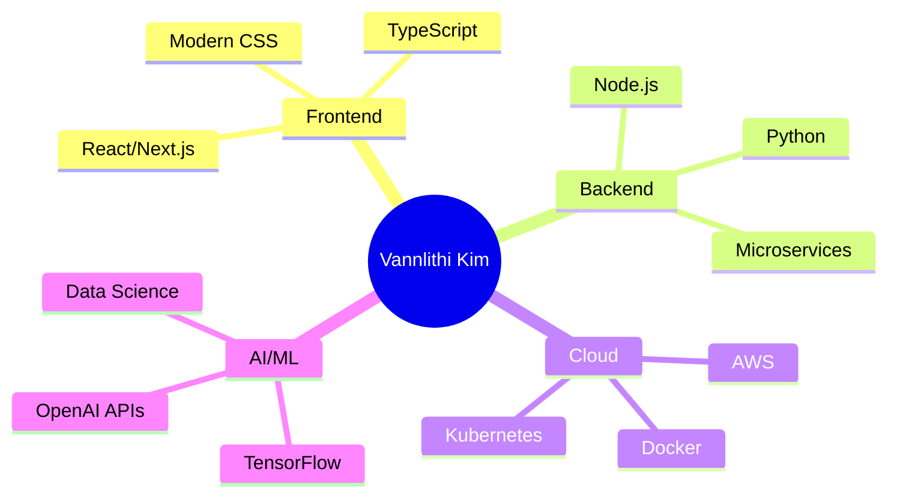

<div align="center">
  
</div>

<div align="center">
  <h1>
     
    Hi there, I'm <span style="color: #FF6B6B;">VANNLITHI KIM</span>
  </h1>
</div>

<div align="center">
  
</div>

<br>

<div align="center">
  
  
  
</div>


## &nbsp;About Me

<div align="center">
  
```yaml
name: "Vannlithi KIM"
location: "Phnom Penh, Cambodia 🇰🇭"
role: "Full Stack Developer"
education: ["Self-Taught Developer", "Computer Science Enthusiast"]
status: "Available for opportunities"

expertise:
  - "Frontend & Backend Development"
  - "Database Architecture"
  - "Cloud Solutions"
  - "DevOps & CI/CD"
  - "Mobile Development"

current_focus:
  - "Next.js 14 & React 18"
  - "TypeScript & Node.js"
  - "AWS & Docker"
  - "AI/ML Integration"

2024_goals:
  - "Contribute to Open Source Projects"
  - "Build Scalable SaaS Products"
  - "Master Cloud Architecture"
  - "Mentor Junior Developers"

when_not_coding: ["Gaming 🎮", "Photography 📸", "Traveling ✈️", "Coffee ☕"]
```

</div>


##  Tech Stack & Tools

<div align="center">

###  Languages

<p>
    
</p>

###  Frontend

<p>
    
</p>

###  Backend

<p>
    
</p>

###  Database & Cloud

<p>
    
</p>

### 🛠️ Development Tools

<p>
    
</p>

</div>


##  GitHub Stats

<div align="center">
  
  
</div>

<div align="center">
  
  
</div>


##  Featured Projects

<div align="center">

### 🏆 Showcase

<table>
<tr>
<td width="50%">
<div align="center">
<h3>🚀 E-Commerce Platform</h3>

<br><br>


<br><br>
<a href="https://github.com/vannlithikim/ecommerce-platform">

</a>
<a href="https://your-demo.com">

</a>
</div>
</td>
<td width="50%">
<div align="center">
<h3>🎨 Portfolio Website</h3>

<br><br>


<br><br>
<a href="https://github.com/vannlithikim/portfolio-website">

</a>
<a href="https://your-portfolio.com">

</a>
</div>
</td>
</tr>
</table>

</div>


##  Let's Connect

<div align="center">

<a href="https://linkedin.com/in/vannlithikim">

</a>
<a href="https://twitter.com/vannlithikim">

</a>
<a href="https://vannlithikim.dev">

</a>
<a href="mailto:vannlithi.kim@gmail.com">

</a>

<br><br>

<a href="https://discord.gg/yourinvite">

</a>
<a href="https://instagram.com/vannlithikim">

</a>
<a href="https://medium.com/@vannlithikim">

</a>
<a href="https://dev.to/vannlithikim">

</a>

</div>


## 🎯 Current Focus

<div align="center">



</div>


## 💭 Developer Wisdom

<div align="center">
  
</div>

<br>

<div align="center">
  
  <br><br>
  <b>✨ "Building the future, one commit at a time" ✨</b>
  <br><br>
  <i>💡 Always learning, always growing, always coding 💡</i>
</div>

<div align="center">
  
</div>
